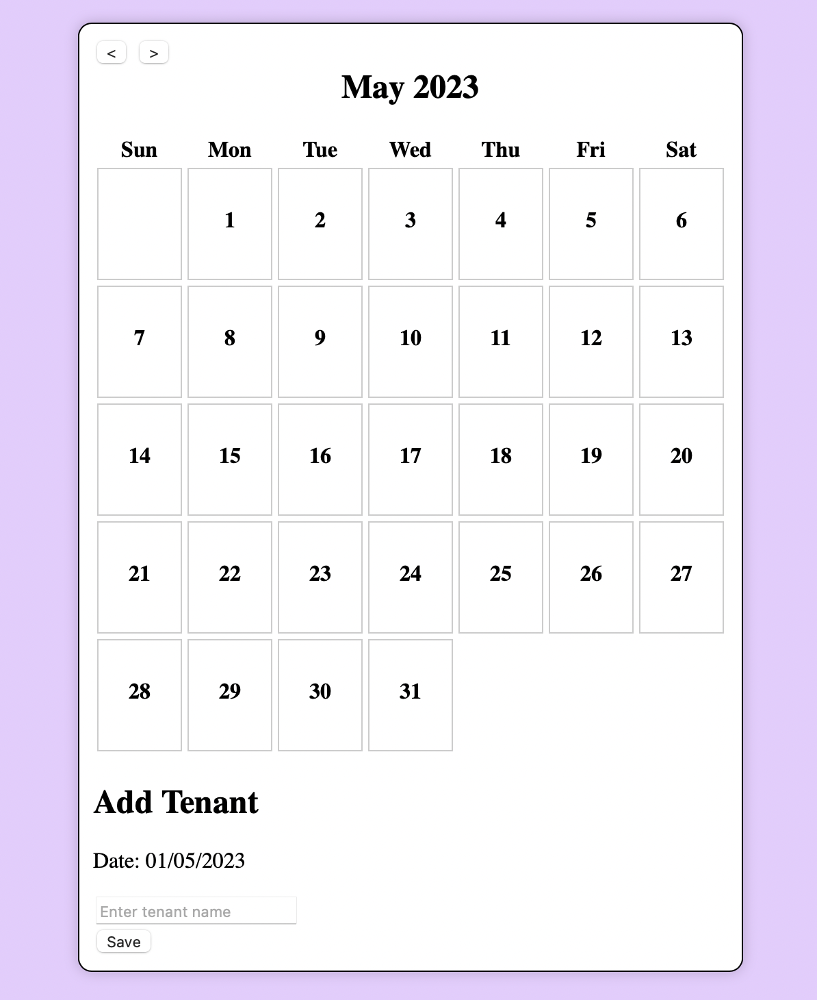

Reservation Calendar
=================

Description
-----------

A calendar that keeps track of reservations for a single room. It has the following features:
- Navigate between months.
- Add tennants to a day.
- Remove tennants from a day.
- Names of tenants are displayed on the calendar.

The calendar:


Adding a tenant:



Removing a tenant:


Getting Started
---------------

Install the package dependencies by running the following command:

```
npm install
```
Once the dependencies are installed, you can start the application server by running

```
npm start
```
Once the server is running, you can start making requests to http://localhost:3000.


Requests
--------

To get the reserved dates you have to pass the start timestamp and end timestamp in the url:
```
> Request
GET localhost:3000/reserve/1585818800000/1685905200000  HTTP/1.1
Accept: application/json

> Response
[
    {
        "tennantName": "Maria",
        "time": 1685818800000
    },
    {
    	"tennantName": "Sarah",
    	"time": 1685905200000
    },
]
```

Changes In Server.JS
--------
The server.js file has been slightly modified to allow for saving tanent information.